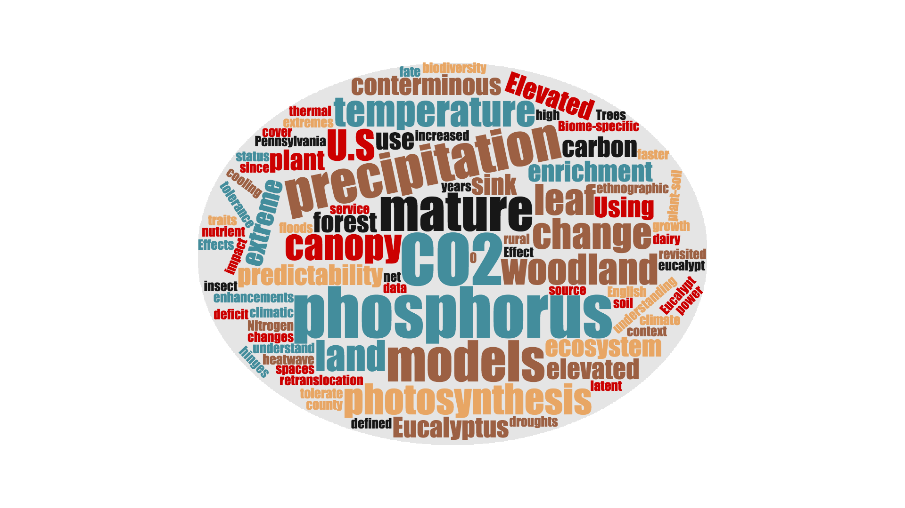

Dr. Jiang is a terrestrial ecosystem ecologist, with broad research interests in plant physiology, global change ecology and mathematical modelling. He has expertise in ecosystem budget accounting, data-model intercomparisons, and landscape-scale model simulations. In his research, Dr. Jiang uses ecological theory, process-based models and manipulative experiments to advance our knowledge of the impacts of global change on terrestrial ecosystems and the associated consequences for ecosystem services. 

